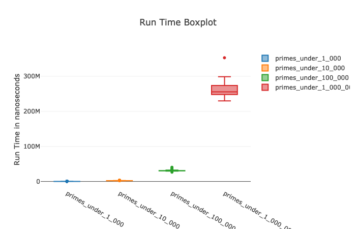

# Primex
This is an educational exercise with the following objectives:
* Refactor and document someone else's code
* Provide a usable primes generator, like ruby's Prime module

Original code comes from http://rosettacode.org/wiki/Sieve_of_Eratosthenes#Elixir

## Installation

If [available in Hex](https://hex.pm/docs/publish), the package can be installed
by adding `primex` to your list of dependencies in `mix.exs`:

```elixir
def deps do
  [
    {:primex, "~> 0.1.0"}
  ]
end
```

Documentation can be generated with [ExDoc](https://github.com/elixir-lang/ex_doc)
and published on [HexDocs](https://hexdocs.pm). Once published, the docs can
be found at [https://hexdocs.pm/primex](https://hexdocs.pm/primex).

# Usage

Currently, Primex provides 2 API functions:

1. `Primex.stream/0`
   ```elixir
   Get a Primes sieve stream

   Examples

      iex> Primex.stream() |> Stream.take(25) |> Enum.to_list()
      [2, 3, 5, 7, 11, 13, 17, 19, 23, 29, 31, 37, 41, 43, 47, 53, 59, 61, 67, 71, 73, 79, 83, 89, 97]

      iex> Primex.stream() |> Stream.take_while(&(&1 < 100)) |> Enum.to_list()
      [2, 3, 5, 7, 11, 13, 17, 19, 23, 29, 31, 37, 41, 43, 47, 53, 59, 61, 67, 71, 73, 79, 83, 89, 97]
  ```


1. `Primex.under/1`
   ```elixir
   Get a stream of Primes under the given limit

   Examples

    iex> Primex.under(100) |> Enum.to_list()
    [2, 3, 5, 7, 11, 13, 17, 19, 23, 29, 31, 37, 41, 43, 47, 53, 59, 61, 67, 71, 73, 79, 83, 89, 97]

   ```
# Benchmarks

To run benchmarks with benchee, use `mix benchmarks/main.exs`


